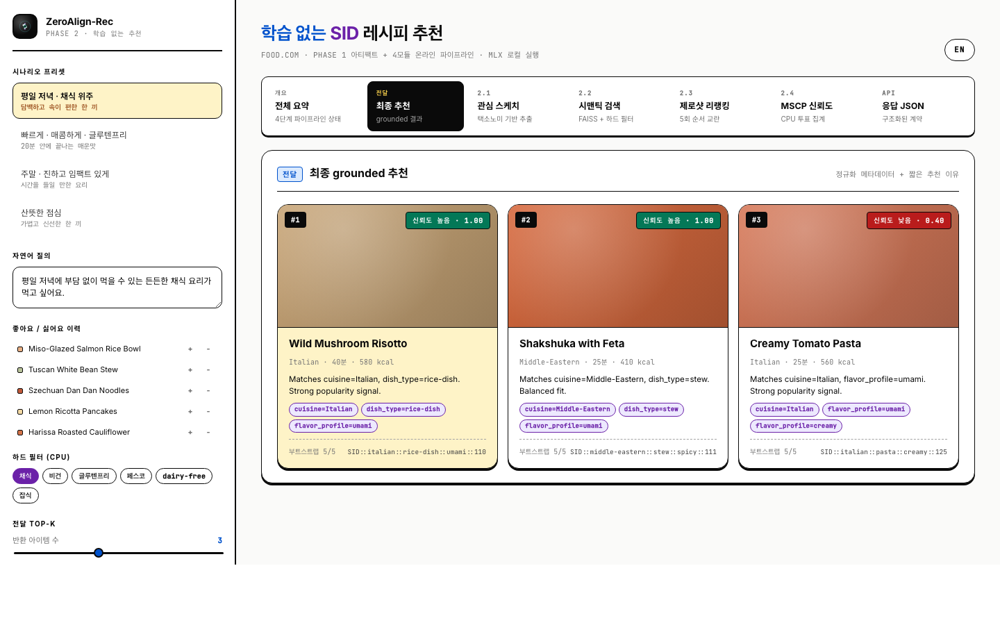
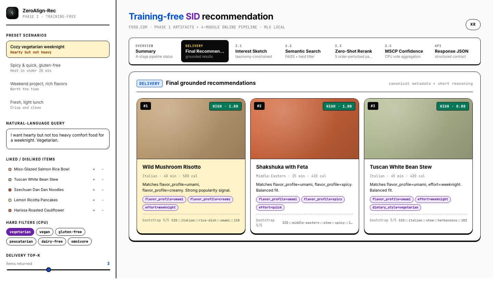
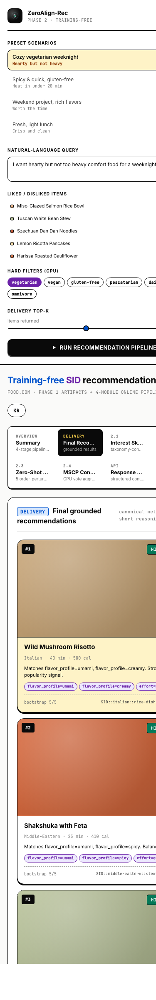

<p align="center">
  
</p>

<h1 align="center">ZeroAlign-Rec</h1>

<p align="center"><strong>Training-free semantic recommendation with SID, local MLX inference, and taxonomy-aware item alignment.</strong></p>

<p align="center"><a href="./README.md">English</a> | <strong>한국어</strong></p>

`ZeroAlign-Rec`은 `SID` 기반 training-free 추천 시스템을 로컬 환경에서 실험하기 위한 Python 코드베이스다. Apple Silicon에서 `MLX`를 사용해 생성형 LLM과 임베딩 모델을 로컬로 실행하고, Food.com 데이터셋 전처리부터 taxonomy dictionary 생성, taxonomy-aligned item structuring까지 한 흐름으로 검증할 수 있다.

현재 Phase 1 진행 상태에는 `src/sid_reco/sid/` 패키지와 public `compile-sid-index` CLI도 포함된다. 이 흐름은 `data/processed/foodcom/sid_index/` 아래에 deterministic structured-item serialization 산출물, MLX embedding 산출물, CPU residual K-means codebook 결과, FAISS indexing 산출물을 저장한다.

## 라이브 데모

4-모듈 온라인 파이프라인(관심 스케치 → 시맨틱 검색 → 제로샷 리랭킹 → MSCP 신뢰도)을 26개 Food.com 시드 레시피 위에서 시각화하는 정적 HTML/JS 번들이다. `?lang=` URL 파라미터로 한국어/영어를 전환하며, 빌드 단계 없이 클라이언트에서 모두 실행된다.

<p align="center">
  <a href="apps/demo/index.html">
    
  </a>
</p>

<details>
<summary>다른 뷰 — 영문 버전과 모바일 반응형</summary>

<p align="center">
  
</p>

<p align="center">
  
</p>

</details>

소스는 [`apps/demo/`](apps/demo/) 아래에 있다. 로컬 HTTP 서버로 `index.html`을 열거나(예: `python3 -m http.server --directory apps/demo`), 폴더를 GitHub Pages로 배포하면 공유 가능한 링크가 된다. 시뮬레이션 파이프라인 단위 테스트는 `apps/demo/tests/`에 있고 `node --test`로 실행한다.

## 목차

- [왜 ZeroAlign-Rec인가](#왜-zeroalign-rec인가)
- [요구 사항](#요구-사항)
- [설치](#설치)
- [빠른 시작](#빠른-시작)
- [핵심 워크플로](#핵심-워크플로)
- [설정](#설정)
- [검증](#검증)
- [저장소 구조](#저장소-구조)
- [문서와 지식 베이스](#문서와-지식-베이스)
- [Copilot 및 Agent 하네스](#copilot-및-agent-하네스)
- [연구 레퍼런스](#연구-레퍼런스)

## 왜 ZeroAlign-Rec인가

- **Training-free recommendation experiments**: SID 기반 추천 흐름을 별도 model training 없이 빠르게 검증할 수 있다.
- **Local-first inference**: `mlx-lm`과 `mlx-embeddings`를 사용해 Apple Silicon에서 로컬 추론을 수행한다.
- **Taxonomy-aware pipeline**: dataset preparation, neighbor index, taxonomy dictionary, item structuring을 단계별로 분리해 재현 가능하게 다룬다.
- **Agent-friendly repository**: Copilot/Codex용 `.github/`, `.agents/skills/`, `.harness/`, `AGENTS.md`가 함께 정리되어 있다.

## 요구 사항

- `macOS` on Apple Silicon
- Python `3.12`
- [`uv`](https://docs.astral.sh/uv/)
- 로컬 터미널 세션 권장

기본 로컬 모델:

- Generative LLM: `mlx-community/Qwen3.5-9B-OptiQ-4bit`
- Embedding model: `mlx-community/Qwen3-Embedding-4B-4bit-DWQ`

지원 환경과 관련해 가장 중요한 점:

- **권장**: 로그인된 로컬 macOS Apple Silicon 세션
- **best-effort**: SSH, CI, 샌드박스, 헤드리스 세션
- MLX/Metal 상태 점검은 `uv run sid-reco smoke-mlx`를 먼저 실행하는 것이 안전하다

## 설치

```bash
uv sync --all-groups
source .venv/bin/activate
cp .env.example .env
```

`.env`는 필요한 값만 채우면 된다. 상세 변수는 아래 [Configuration](#configuration)을 참고한다.

## 빠른 시작

가장 빠른 smoke path는 아래 순서다.

```bash
uv run sid-reco doctor
uv run sid-reco smoke-mlx
uv run sid-reco smoke-llm "사용자 취향을 요약해줘"
uv run sid-reco smoke-embed "범죄 스릴러 영화 추천"
```

이후 end-to-end 실험은 다음 순서로 이어간다.

```bash
uv run sid-reco prepare-foodcom --raw-dir data/raw/foodcom --out-dir data/processed/foodcom
uv run sid-reco build-neighbor-context
uv run sid-reco build-taxonomy-dictionary
uv run sid-reco structure-taxonomy-batch \
  --recipes-path data/processed/foodcom/recipes.csv \
  --neighbor-context-path data/processed/foodcom/neighbor_context/neighbor_context.csv \
  --taxonomy-dictionary-path data/processed/foodcom/taxonomy_dictionary/food_taxonomy_dictionary.json \
  --out-path data/processed/foodcom/taxonomy_structured/items.jsonl
uv run sid-reco compile-sid-index \
  --structured-items-path data/processed/foodcom/taxonomy_structured/items.jsonl \
  --taxonomy-dictionary-path data/processed/foodcom/taxonomy_dictionary/food_taxonomy_dictionary.json \
  --out-dir data/processed/foodcom/sid_index
```

## 핵심 워크플로

### 1. Food.com 데이터셋 준비

원본 CSV를 small-scale 실험용 catalog와 split으로 정리한다.

```bash
uv run sid-reco prepare-foodcom \
  --raw-dir data/raw/foodcom \
  --out-dir data/processed/foodcom \
  --top-recipes 3000 \
  --core-k 5 \
  --positive-threshold 4
```

주요 산출물:

- `data/processed/foodcom/recipes.csv`
- `data/processed/foodcom/interactions.csv`
- `data/processed/foodcom/splits/{train,valid,test}.csv`
- `data/processed/foodcom/manifest.json`

### 2. Neighbor context 생성

item metadata embedding과 FAISS 기반 top-k neighbor context를 생성한다.

```bash
uv run sid-reco build-neighbor-context \
  --recipes-path data/processed/foodcom/recipes.csv \
  --out-dir data/processed/foodcom/neighbor_context \
  --top-k 5
```

주요 산출물:

- `items_with_embeddings.csv`
- `neighbor_context.csv`
- `item_index.faiss`
- `manifest.json`

### 3. Taxonomy dictionary 생성

로컬 LLM으로 domain taxonomy dictionary를 생성한다.
이 단계는
[Taxonomy-Guided Zero-Shot Recommendations with LLMs](https://aclanthology.org/2025.coling-main.102/)
(Liang et al., COLING 2025)와
[TaxRec 공개 구현](https://github.com/yueqingliang1/TaxRec)의
one-time taxonomy categorization 아이디어를 참고했다.
다만 이 저장소는 taxonomy dictionary 구축 아이디어만 가져온 것이며,
TaxRec의 전체 recommendation/evaluation 파이프라인을 구현한 것은 아니다.

```bash
uv run sid-reco build-taxonomy-dictionary \
  --recipes-path data/processed/foodcom/recipes.csv \
  --out-dir data/processed/foodcom/taxonomy_dictionary \
  --max-tokens 4096
```

주요 산출물:

- `food_taxonomy_dictionary.json`
- `prompt_snapshot.json`

### 4. Taxonomy-aligned JSON으로 item 구조화

taxonomy dictionary와 neighbor context를 함께 사용해 item별 structured output을 만든다.
이 단계는
[Unleashing the Native Recommendation Potential: LLM-Based Generative Recommendation via Structured Term Identifiers](https://arxiv.org/abs/2601.06798)
와 [GRLM 공개 구현](https://github.com/ZY0025/GRLM)의
Context-aware Term Generation 아이디어, 특히 similar-item neighborhood를
LLM 입력의 contextual guidance로 함께 넣는 방식을 참고했다.
다만 이 저장소는 top-5 neighbor prompting 아이디어만 차용한 것이며,
GRLM의 전체 Term ID generation, instruction fine-tuning, grounding 파이프라인을 구현한 것은 아니다.

단일 item:

```bash
uv run sid-reco structure-taxonomy-item \
  --recipe-id 101 \
  --recipes-path data/processed/foodcom/recipes.csv \
  --neighbor-context-path data/processed/foodcom/neighbor_context/neighbor_context.csv \
  --taxonomy-dictionary-path data/processed/foodcom/taxonomy_dictionary/food_taxonomy_dictionary.json
```

batch:

```bash
uv run sid-reco structure-taxonomy-batch \
  --recipes-path data/processed/foodcom/recipes.csv \
  --neighbor-context-path data/processed/foodcom/neighbor_context/neighbor_context.csv \
  --taxonomy-dictionary-path data/processed/foodcom/taxonomy_dictionary/food_taxonomy_dictionary.json \
  --out-path data/processed/foodcom/taxonomy_structured/items.jsonl
```

### 5. 계층형 SID 및 FAISS 인덱스 컴파일

structured item을 deterministic serialized text, dense embedding, hierarchical SID path, FAISS 인덱스로 컴파일한다.
이 단계의 text serialization은 아이템 메타데이터를 임베딩 전에 하나의 document-like 문자열로
평탄화하는 전처리 관행을 참고한다. 특히
[Beyond Relevance: An Adaptive Exploration-Based Framework for Personalized Recommendations](https://arxiv.org/html/2503.19525v1)
와
[Semantic IDs for Joint Generative Search and Recommendation](https://arxiv.org/html/2508.10478v1)
처럼 메타데이터를 단일 텍스트 표현으로 결합하는 방식을 참고하되,
이 저장소는 raw title/description만이 아니라 taxonomy-structured TID 필드를 직렬화 대상으로 사용한다.
Dense embedding 생성 역시 텍스트를 전용 embedding model로 의미 공간에 투영하는 최근 추천 연구의
관행을 참고한다. 예를 들어
[Beyond Relevance: An Adaptive Exploration-Based Framework for Personalized Recommendations](https://arxiv.org/html/2503.19525v1)
는 sentence-transformer 기반 item embedding을 사용한다.
이 저장소는 같은 큰 패턴을 따르되, `mlx-community/Qwen3-Embedding-4B-4bit-DWQ`를 사용해
taxonomy-structured serialized text를 로컬 MLX 환경에서 임베딩한다.
현재 FAISS 단계는 `faiss.IndexFlatIP` 기반의 offline exact 인덱스와 mapping artifact를
저장하는 구현이다. 즉 이후 retrieval 실험을 위한 기반 산출물을 준비하는 단계이며,
아직 query-time ANN 검색이나 LLM 조건부 top-k 후보 압축 계층까지는 포함하지 않는다.

```bash
uv run sid-reco compile-sid-index \
  --structured-items-path data/processed/foodcom/taxonomy_structured/items.jsonl \
  --taxonomy-dictionary-path data/processed/foodcom/taxonomy_dictionary/food_taxonomy_dictionary.json \
  --out-dir data/processed/foodcom/sid_index
```

주요 산출물:

- `serialized_items.jsonl`
- `embeddings.npy`
- `embedding_manifest.json`
- `compiled_sid.jsonl`
- `item_to_sid.json`
- `sid_to_items.json`
- `id_map.jsonl`
- `item_index.faiss`
- `manifest.json`

## 설정

`.env.example`를 기준으로 `.env`를 만들고 필요한 값만 조정하면 된다.

| Variable | Description |
| --- | --- |
| `SID_RECO_LLM_BACKEND` | 현재는 `mlx` 사용 |
| `SID_RECO_LLM_MODEL` | 생성형 LLM 모델 이름 |
| `SID_RECO_EMBED_MODEL` | 임베딩 모델 이름 |
| `SID_RECO_CATALOG_PATH` | item metadata catalog 경로 |
| `SID_RECO_CACHE_DIR` | intermediate artifacts / cache 경로 |
| `SID_RECO_LLM_MAX_TOKENS` | 기본 생성 토큰 수 |
| `SID_RECO_LLM_TEMPERATURE` | 기본 temperature |
| `SID_RECO_LLM_TOP_P` | 기본 nucleus sampling 값 |

## 검증

```bash
uv run sid-reco doctor
uv run sid-reco smoke-mlx
uv run pytest
uv run ruff check .
uv run mypy src
```

## 저장소 구조

| Path | Role |
| --- | --- |
| `src/sid_reco/` | application package |
| `src/sid_reco/sid/` | Phase 1 SID serialization 및 embedding artifact helper |
| `tests/` | automated tests |
| `apps/demo/` | 추천 파이프라인을 보여주는 정적 frontend demo |
| `data/` | local datasets and processed artifacts |
| `assets/` | authored static assets (branding, media) |
| `docs/` | legacy docs-first knowledge archive |
| `graphify-out/` | primary committed knowledge graph artifacts |
| `.github/` | Copilot-facing instructions and agent personas |
| `.agents/skills/` | repo-local agent skills |
| `.harness/` | internal harness support and reference assets |
| `AGENTS.md` | top-level repository rules and schema |

## 문서와 지식 베이스

상세 설명은 README에 길게 중복하기보다 `graphify-out/`와 `raw/` source corpus에 정리한다.

주요 그래프 산출물:

- [graphify-out/GRAPH_REPORT.md](graphify-out/GRAPH_REPORT.md)
- [graphify-out/graph.json](graphify-out/graph.json)
- [graphify-out/graph.html](graphify-out/graph.html)

갱신 명령:

```bash
scripts/graphify_code_refresh.sh
```

현재 wrapper는 `graphify update .` 기반 AST-only refresh다.
즉 committed code graph bootstrap과 code drift 반영에는 충분하다.
문서/설계 semantic refresh는 staged producer 경로로 실제 실행할 수 있고,
full refresh 입력은 `src/`, `tests/`, `raw/`만 사용한다.
이제 PostToolUse hook이 relevant한 로컬 변경 뒤 그래프 갱신을 자동으로 시도한다.
코드 변경만 있으면 `code_update`로 끝날 수 있고, `raw/` 변경이 있으면
staged full refresh -> verify -> sync까지 자동으로 수행한다.

full refresh 준비:

```bash
scripts/graphify_prepare_corpus.sh
```

full refresh orchestration은 repo-local `graphify-manager` / `graphify-full` skill이 담당하며,
실제 producer는 아래 명령으로 staged corpus에 대해 실행된다.

```bash
uv run --with graphifyy==0.4.23 python scripts/graphify_full_refresh.py .graphify-work/corpus
```

staged full refresh 뒤에는 아래 순서로 검증/동기화한다.

```bash
python3 scripts/graphify_verify_full_refresh.py .graphify-work/corpus/graphify-out
bash scripts/graphify_sync_staged.sh
```

CI는 relevant 변경이 있으면 candidate note만 남긴다.
full refresh producer 실행, staged verify, root `graphify-out/` 승격은 여전히 자동으로 하지 않는다.

source corpus:

- [raw/README.md](raw/README.md)
- `raw/design/`
- `raw/external/`

Graphify 입력에는 `references/`, `README*`, `SPEC.md`, `CLAUDE.md`/`AGENTS.md`가 포함되지 않는다.

## Copilot 및 Agent 하네스

이 저장소는 Copilot/Codex 친화적인 harness를 함께 유지한다.

- primary knowledge graph: `graphify-out/`
- Claude Code active safety hooks: `.claude/settings.json`
- Copilot 프로젝트 지침: `.github/copilot-instructions.md`
- specialized personas: `.github/agents/`
- repo-local skills: `.agents/skills/`
- harness support assets: `.harness/`
- local adaptation rules: `.harness/reference/local-adaptation.md`
- optional phase executor: `scripts/execute.py`
- optional phase bundle schema: `phases/README.md`

주요 shortcut:

- `/docs-manager` or `/doc-manager` — Graphify sync/review plus `raw/` source corpus and harness sync
- `/spec`
- `/plan`
- `/build`
- `/test`
- `/code-simplify`
- `/ship`

코드베이스/아키텍처 질문은 먼저 `graphify-out/GRAPH_REPORT.md`를 읽고,
`graphify-out/graph.json`을 primary machine-readable graph로 사용한다.
또 `graphify-out/BUILD_INFO.json`을 읽어:
- `mode=code_update`이면 그래프가 코드 중심 refresh 상태이고
- `mode=full_refresh`이며 `verified=true`이면 그래프가 현재 `raw/` source corpus를 반영한다고 본다.
재현 가능한 구현 실행이 필요할 때는 `tasks/`를 사람용 계획 영역으로 유지하고,
`phases/`를 선택적 Claude-driven 실행 영역으로 사용한다.

## 연구 레퍼런스

이 저장소의 일부 컴포넌트는 선행 연구의 특정 아이디어를 부분적으로 참고한다.
따라서 해당 아이디어를 설명하거나 재사용할 때는 이 저장소만이 아니라 원 논문도 함께 인용하는 것이 적절하다.

### TaxRec

`Taxonomy Dictionary` 단계는
[Taxonomy-Guided Zero-Shot Recommendations with LLMs](https://aclanthology.org/2025.coling-main.102/)
및 [TaxRec 공개 구현](https://github.com/yueqingliang1/TaxRec)의
one-time taxonomy categorization 아이디어만 참고한다.
다만 이 저장소는 TaxRec의 전체 recommendation/evaluation 파이프라인을 구현하지는 않는다.

```bibtex
@inproceedings{liang-etal-2025-taxonomy,
  title={Taxonomy-Guided Zero-Shot Recommendations with LLMs},
  author={Liang, Yueqing and Yang, Liangwei and Wang, Chen and Xu, Xiongxiao and Yu, Philip S. and Shu, Kai},
  booktitle={Proceedings of the 31st International Conference on Computational Linguistics},
  pages={1520--1530},
  year={2025},
  address={Abu Dhabi, UAE},
  publisher={Association for Computational Linguistics},
  url={https://aclanthology.org/2025.coling-main.102/}
}
```

### GRLM

`Taxonomy Item Structuring` 단계는
[Unleashing the Native Recommendation Potential: LLM-Based Generative Recommendation via Structured Term Identifiers](https://arxiv.org/abs/2601.06798)
및 [GRLM 공개 구현](https://github.com/ZY0025/GRLM)에서
`similar-item neighborhood`를 LLM 입력의 문맥 가이드로 사용하는 발상을 참고한다.
다만 이 저장소는 GRLM의 전체 학습, grounding, recommendation 파이프라인을 구현하지는 않는다.

```bibtex
@article{zhang2026unleashing,
  title={Unleashing the Native Recommendation Potential: LLM-Based Generative Recommendation via Structured Term Identifiers},
  author={Zhang, Zhiyang and She, Junda and Cai, Kuo and Chen, Bo and Wang, Shiyao and Luo, Xinchen and Luo, Qiang and Tang, Ruiming and Li, Han and Gai, Kun and others},
  journal={arXiv preprint arXiv:2601.06798},
  year={2026}
}
```
